# HelloAgents 项目架构分析文档

> **项目概述**: HelloAgents 是一个专为学习和教学设计的轻量级多智能体框架，基于 OpenAI 原生 API 构建，提供从简单对话到复杂推理的完整 Agent 范式实现。
>
> **核心设计理念**: 除了核心的 Agent 类，一切皆为 Tools（工具）。Memory（记忆）、RAG（检索增强生成）、RL（强化学习）、MCP（协议）等模块都被统一抽象为工具，消除不必要的抽象层。

---

## 📊 整体架构图

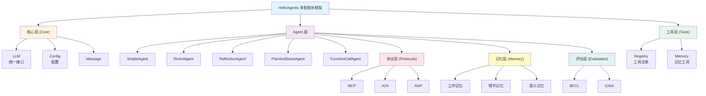

---

## 🏗️ 核心架构层次

### 1. 核心层 (Core Layer)

**位置**: `hello_agents/core/`

#### 1.1 HelloAgentsLLM - 统一 LLM 接口

**文件**: `core/llm.py`

**功能**:

- 为 HelloAgents 提供统一的 LLM 调用接口
- 支持多种 LLM 提供商（OpenAI、DeepSeek、Qwen、ModelScope、Kimi、智谱、Ollama、vLLM 等）
- 自动检测提供商或手动指定
- 默认使用流式响应，提供更好的用户体验

**关键特性**:

```python
# 支持的提供商
SUPPORTED_PROVIDERS = [
    "openai", "deepseek", "qwen", "modelscope",
    "kimi", "zhipu", "ollama", "vllm", "local", "auto", "custom"
]

# 自动检测逻辑
1. 检查特定提供商的环境变量
2. 根据 API 密钥格式判断
3. 根据 base_url 判断
4. 默认返回通用配置
```

**设计理念**:

- 参数优先，环境变量兜底
- 统一接口，降低学习成本
- 流式响应为默认

#### 1.2 Agent - Agent 基类

**文件**: `core/agent.py`

**功能**:

- 定义所有 Agent 的基础接口
- 管理 Agent 的名称、LLM、系统提示词、配置
- 提供历史记录管理

**核心方法**:

```python
@abstractmethod
def run(self, input_text: str, **kwargs) -> str:
    """运行 Agent - 子类必须实现"""
    pass

def add_message(self, message: Message):
    """添加消息到历史记录"""

def clear_history(self):
    """清空历史记录"""

def get_history(self) -> list[Message]:
    """获取历史记录"""
```

#### 1.3 其他核心组件

- **Config** (`core/config.py`): 配置管理
- **Message** (`core/message.py`): 消息结构
- **Exceptions** (`core/exceptions.py`): 异常处理
- **DatabaseConfig** (`core/database_config.py`): 数据库配置

---

### 2. Agent 层 (Agent Layer)

**位置**: `hello_agents/agents/`

提供多种 Agent 范式，适应不同场景需求。

#### 2.1 SimpleAgent - 简单对话 Agent

**文件**: `agents/simple_agent.py`

**特点**:

- 基础对话能力
- 可选的工具调用支持
- 工具调用格式: `[TOOL_CALL:{tool_name}:{parameters}]`

**使用场景**:

- 简单问答
- 基础对话
- 工具辅助的对话

**工作流程**:

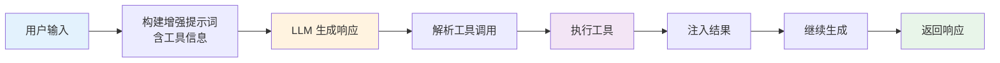

#### 2.2 ReActAgent - 推理与行动结合

**文件**: `agents/react_agent.py`

**特点**:

- 结合推理（Reasoning）和行动（Acting）
- 迭代执行直到得出最终答案
- 适合需要外部信息的复杂任务

**工作流程**:

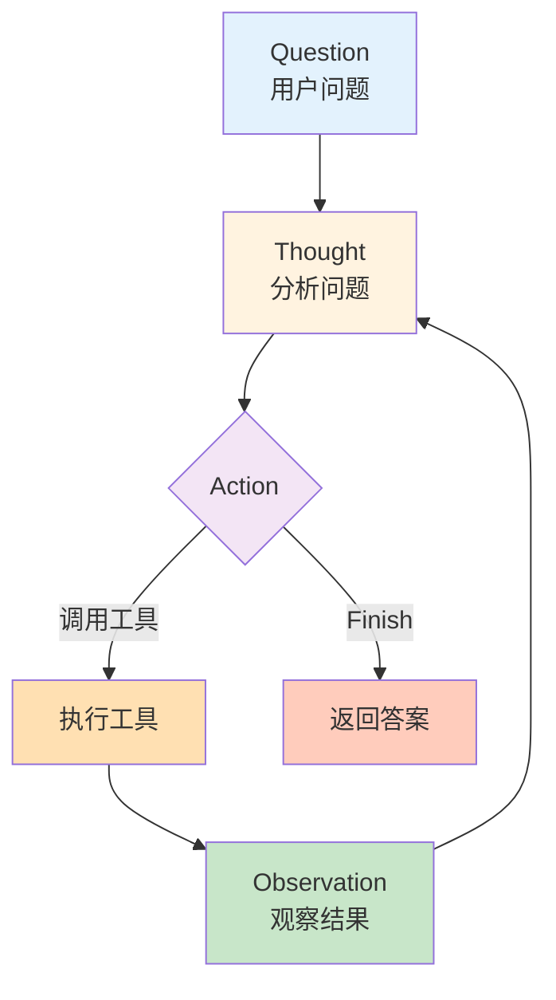

**提示词结构**:

```
Thought: 分析问题，确定需要什么信息
Action: 工具名[参数] 或 Finish[结论]
Observation: 工具返回的结果
```

#### 2.3 ReflectionAgent - 自我反思 Agent

**文件**: `agents/reflection_agent.py`

**特点**:

- 生成初始答案后进行自我反思
- 识别问题并迭代优化
- 提高答案质量和准确性

**工作流程**:

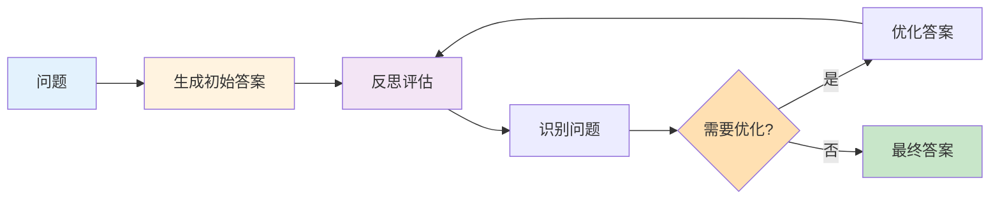

#### 2.4 PlanAndSolveAgent - 计划与执行 Agent

**文件**: `agents/plan_solve_agent.py`

**特点**:

- 先制定计划，再逐步执行
- 适合复杂多步骤任务
- 计划与执行分离

**工作流程**:

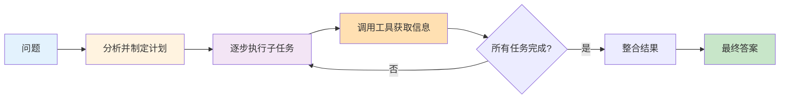

#### 2.5 FunctionCallAgent - 函数调用 Agent

**文件**: `agents/function_call_agent.py`

**特点**:

- 使用 OpenAI 原生函数调用机制
- 自动将工具转换为 OpenAI function schema
- 支持多次工具迭代调用

**工作流程**:

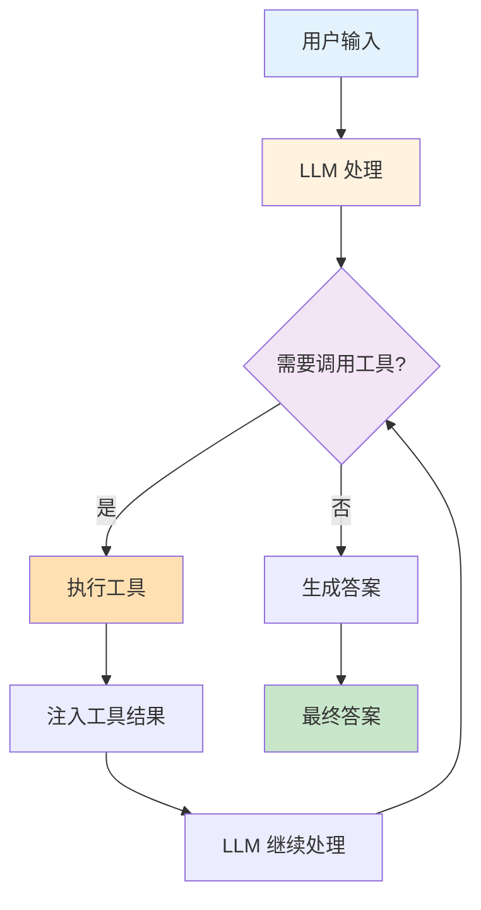

#### 2.6 ToolAwareAgent - 工具感知 Agent

**文件**: `agents/tool_aware_agent.py`

**特点**:

- 扩展 SimpleAgent，增强工具调用能力
- 更智能的工具选择和参数推断

---

### 3. 工具层 (Tools Layer)

**位置**: `hello_agents/tools/`

工具系统是 HelloAgents 的核心特性，将 Memory、RAG、RL 等都抽象为工具。

#### 3.1 工具基类架构

**文件**: `tools/base.py`

**核心概念**:

**Tool 基类**:

```python
class Tool(ABC):
    def __init__(self, name: str, description: str, expandable: bool = False):
        """
        expandable: 工具是否可展开为多个子工具
        """

    @abstractmethod
    def run(self, parameters: Dict[str, Any]) -> str:
        """执行工具"""

    @abstractmethod
    def get_parameters(self) -> List[ToolParameter]:
        """获取工具参数定义"""

    def get_expanded_tools(self) -> Optional[List['Tool']]:
        """获取展开后的子工具列表"""
```

**工具展开机制**:

- 支持 `@tool_action` 装饰器自动生成子工具
- 一个复杂工具可以展开为多个独立功能
- 例如: MemoryTool 展开为 memory_add、memory_retrieve 等

#### 3.2 ToolRegistry - 工具注册表

**文件**: `tools/registry.py`

**功能**:

- 工具的注册、管理和执行
- 支持两种注册方式:
  - Tool 对象注册（推荐）
  - 函数直接注册（简便）
- 自动展开可展开的工具

**核心方法**:

```python
def register_tool(self, tool: Tool, auto_expand: bool = True)
def register_function(self, name: str, description: str, func: Callable)
def execute_tool(self, name: str, input_text: str) -> str
def get_tools_description(self) -> str
```

#### 3.3 内置工具 (Built-in Tools)

**位置**: `tools/builtin/`

##### 3.3.1 SearchTool - 搜索工具

**文件**: `builtin/search_tool.py`

- 支持 Tavily、SerpAPI 等搜索引擎
- 网页搜索能力

##### 3.3.2 CalculatorTool - 计算器工具

**文件**: `builtin/calculator.py`

- 数学表达式计算
- 支持基本运算、数学函数

##### 3.3.3 MemoryTool - 记忆工具

**文件**: `builtin/memory_tool.py`

- 将记忆系统封装为工具
- 支持添加、检索、更新、删除记忆
- **可展开工具**: 展开为多个独立的记忆操作工具

**展开的子工具**:

```python
@tool_action("memory_add", "添加新记忆")
def _add_memory(self, content: str, importance: float = 0.5) -> str

@tool_action("memory_retrieve", "检索相关记忆")
def _retrieve_memory(self, query: str, limit: int = 5) -> str

@tool_action("memory_update", "更新现有记忆")
def _update_memory(self, memory_id: str, content: str) -> str
```

##### 3.3.4 RAGTool - 检索增强生成工具

**文件**: `builtin/rag_tool.py`

- 文档管理（添加、删除、列出）
- 智能检索与问答
- 支持多种文档格式（PDF、Word、Excel、图片等）
- 命名空间隔离

**核心功能**:

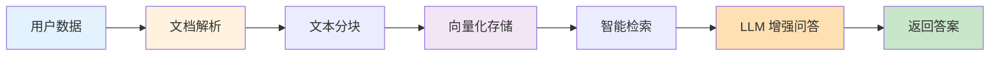

##### 3.3.5 MCPWrapperTool - MCP 协议工具

**文件**: `builtin/mcp_wrapper_tool.py`

- 将 MCP 服务器封装为工具
- 支持自动展开 MCP 工具

##### 3.3.6 其他工具

- **NoteTool**: 笔记管理工具
- **TerminalTool**: 终端命令执行工具
- **ProtocolTools**: 协议通信工具（A2A、ANP）
- **RLTrainingTool**: 强化学习训练工具
- **BFCLEvaluationTool**: BFCL 评估工具
- **GAIAEvaluationTool**: GAIA 评估工具
- **LLMJudgeTool**: LLM 裁判工具
- **WinRateTool**: 胜率计算工具

#### 3.4 工具链 (Tool Chain)

**文件**: `tools/chain.py`

**功能**:

- 工具的顺序执行
- 上一个工具的输出作为下一个工具的输入
- 支持复杂的工具组合流程

#### 3.5 异步工具执行器

**文件**: `tools/async_executor.py`

**功能**:

- 异步执行工具
- 提高执行效率

---

### 4. 记忆层 (Memory Layer)

**位置**: `hello_agents/memory/`

记忆系统基于认知心理学的记忆模型设计，提供四种记忆类型。

#### 4.1 记忆基础架构

**文件**: `memory/base.py`

**核心组件**:

**MemoryItem - 记忆项**:

```python
class MemoryItem(BaseModel):
    id: str
    content: str
    memory_type: str
    user_id: str
    timestamp: datetime
    importance: float = 0.5
    metadata: Dict[str, Any] = {}
```

**MemoryConfig - 记忆配置**:

```python
class MemoryConfig(BaseModel):
    storage_path: str = "./memory_data"
    max_capacity: int = 100
    importance_threshold: float = 0.1
    working_memory_capacity: int = 10
    # ... 其他配置
```

**BaseMemory - 记忆基类**:

- 定义所有记忆类型的通用接口
- `add()`, `retrieve()`, `update()`, `remove()`, `clear()`

#### 4.2 记忆类型

##### 4.2.1 WorkingMemory - 工作记忆

**文件**: `memory/types/working.py`

**特点**:

- 容量有限（默认 10 条）
- 支持时间衰减（TTL）
- 用于短期上下文管理

**存储**: 内存存储，重启后丢失

##### 4.2.2 EpisodicMemory - 情节记忆

**文件**: `memory/types/episodic.py`

**特点**:

- 存储事件、对话等时序信息
- 支持时间范围检索
- 自动提取实体和关键词

**存储**: Neo4j 图数据库

##### 4.2.3 SemanticMemory - 语义记忆

**文件**: `memory/types/semantic.py`

**特点**:

- 存储知识、概念等语义信息
- 基于向量相似度检索
- 支持知识图谱

**存储**: Qdrant 向量数据库

##### 4.2.4 PerceptualMemory - 感知记忆

**文件**: `memory/types/perceptual.py`

**特点**:

- 存储感官信息（文本、图像、音频、视频）
- 多模态支持

**存储**: 文件系统 + 元数据索引

#### 4.3 MemoryManager - 记忆管理器

**文件**: `memory/manager.py`

**功能**:

- 统一的记忆操作接口
- 记忆生命周期管理
- 自动分类记忆类型
- 重要性评估
- 遗忘和清理机制

**核心方法**:

```python
def add_memory(self, content: str, memory_type: str,
               importance: float, auto_classify: bool) -> str
def retrieve_memory(self, query: str, memory_types: List[str],
                   limit: int) -> List[MemoryItem]
def _classify_memory_type(self, content: str) -> str
def _calculate_importance(self, content: str) -> float
```

#### 4.4 RAG 系统

**位置**: `memory/rag/`

##### 4.4.1 RAG Pipeline

**文件**: `memory/rag/pipeline.py`

**功能**:

- 完整的 RAG 流水线
- 文档解析、分块、向量化、检索、生成

**核心组件**:

- `RAGPipeline`: 主流水线类
- `create_rag_pipeline()`: 工厂函数

##### 4.4.2 Document 处理

**文件**: `memory/rag/document.py`

**功能**:

- 多格式文档解析（PDF、Word、Excel、PPT、图片、音频等）
- 使用 markitdown 进行文档转换
- 智能分块策略

#### 4.5 存储后端

**位置**: `memory/storage/`

- **DocumentStore** (`storage/document_store.py`): 文档存储
- **Neo4jStore** (`storage/neo4j_store.py`): Neo4j 图数据库
- **QdrantStore** (`storage/qdrant_store.py`): Qdrant 向量数据库

#### 4.6 Embedding - 嵌入模型

**文件**: `memory/embedding.py`

**功能**:

- 文本向量化
- 支持多种嵌入模型

---

### 5. 协议层 (Protocols Layer)

**位置**: `hello_agents/protocols/`

提供多种 Agent 通信协议，实现 Agent 间协作。

#### 5.1 协议基类

**文件**: `protocols/base.py`

**ProtocolType 枚举**:

```python
class ProtocolType(Enum):
    MCP = "mcp"  # Model Context Protocol
    A2A = "a2a"  # Agent-to-Agent Protocol
    ANP = "anp"  # Agent Network Protocol
```

#### 5.2 MCP - Model Context Protocol

**位置**: `protocols/mcp/`

**特点**:

- 基于 FastMCP 库实现
- 支持多种传输方式（Memory, Stdio, HTTP, SSE）
- 工具发现和远程调用

**核心文件**:

- **client.py**: MCP 客户端，支持多种传输方式
- **server.py**: MCP 服务器
- **utils.py**: MCP 工具函数

**使用示例**:

```python
# Stdio 传输
client = MCPClient("server.py")

# HTTP 传输
client = MCPClient("https://api.example.com/mcp")

# Memory 传输（测试）
from fastmcp import FastMCP
server = FastMCP("TestServer")
client = MCPClient(server)
```

#### 5.3 A2A - Agent-to-Agent Protocol

**位置**: `protocols/a2a/`

**文件**: `a2a/implementation.py`

**特点**:

- Agent 间直接通信
- 使用官方 a2a-sdk
- 支持消息传递和任务委托

#### 5.4 ANP - Agent Network Protocol

**位置**: `protocols/anp/`

**文件**: `anp/implementation.py`

**特点**:

- 概念性实现
- Agent 网络协议
- 支持多 Agent 协作

---

### 6. 强化学习层 (RL Layer)

**位置**: `hello_agents/rl/`

提供强化学习训练能力，用于优化 Agent 性能。

#### 6.1 核心组件

##### 6.1.1 Trainers - 训练器

**文件**: `rl/trainers.py`

**功能**:

- 封装 TRL (Transformer Reinforcement Learning) 训练器
- 提供统一的训练接口

**支持的训练器**:

- **BaseTrainerWrapper**: 训练器基类
- **GRPOTrainerWrapper**: GRPO (Generalized Reward-based Policy Optimization) 训练器
- 其他训练器...

**特性**:

- 详细日志回调
- 训练进度显示
- Loss、Reward、KL 散度等指标监控

##### 6.1.2 Rewards - 奖励函数

**文件**: `rl/rewards.py`

**功能**:

- 定义各种奖励函数
- 评估 Agent 响应质量

##### 6.1.3 Datasets - 数据集

**文件**: `rl/datasets.py`

**功能**:

- 数据集加载和处理
- 支持 HuggingFace datasets

##### 6.1.4 Utils - 工具函数

**文件**: `rl/utils.py`

**功能**:

- 训练配置 (`TrainingConfig`)
- 依赖检查
- 安装指南

---

### 7. 评估层 (Evaluation Layer)

**位置**: `hello_agents/evaluation/`

提供多种评估基准测试，衡量 Agent 性能。

#### 7.1 评估基准

##### 7.1.1 BFCL - Berkeley Function Calling Leaderboard

**位置**: `evaluation/benchmarks/bfcl/`

**功能**:

- 函数调用能力评估
- 工具使用准确性测试

**核心文件**:

- **evaluator.py**: BFCL 评估器
- **converter.py**: 数据转换
- **executor.py**: 执行器

##### 7.1.2 GAIA - General AI Assistants Benchmark

**位置**: `evaluation/benchmarks/gaia/`

**功能**:

- 通用 AI 助手能力评估
- 多任务综合测试

**核心文件**:

- **evaluator.py**: GAIA 评估器
- **converter.py**: 数据转换
- **executor.py**: 执行器

##### 7.1.3 数据生成评估

**位置**: `evaluation/benchmarks/data_generation/`

**LLM Judge 评估**:

- **llm_judge.py**: 使用 LLM 作为裁判评估响应质量
- 自动化评分

**Win Rate 评估**:

- **win_rate.py**: 胜率计算
- A/B 测试支持

---

### 8. 上下文工程层 (Context Engineering)

**位置**: `hello_agents/context/`

#### 8.1 ContextBuilder - 上下文构建器

**文件**: `context/builder.py`

**GSSC 流水线**:

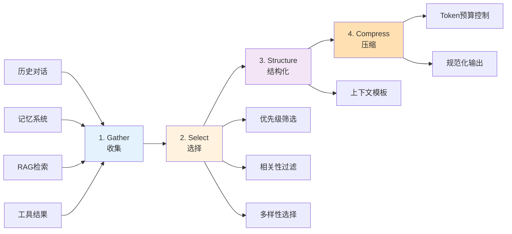

1. **Gather** (收集): 从多源收集候选信息（历史、记忆、RAG、工具结果）
2. **Select** (选择): 基于优先级、相关性、多样性筛选
3. **Structure** (结构化): 组织成结构化上下文模板
4. **Compress** (压缩): 在预算内压缩与规范化

**核心概念**:

**ContextPacket - 上下文信息包**:

```python
@dataclass
class ContextPacket:
    content: str
    timestamp: datetime
    metadata: Dict[str, Any]
    token_count: int
    relevance_score: float  # 0.0-1.0
```

**ContextConfig - 上下文配置**:

```python
@dataclass
class ContextConfig:
    max_tokens: int = 8000
    reserve_ratio: float = 0.15
    min_relevance: float = 0.3
    enable_mmr: bool = True  # 最大边际相关性
    mmr_lambda: float = 0.7
```

**使用示例**:

```python
builder = ContextBuilder(
    memory_tool=memory_tool,
    rag_tool=rag_tool,
    config=ContextConfig(max_tokens=8000)
)

context = builder.build(
    user_query="用户问题",
    conversation_history=[...],
    system_instructions="系统指令"
)
```

---

## 📦 模块依赖关系

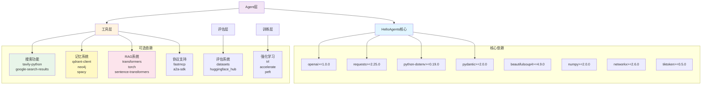

### 核心依赖

```
openai>=1.0.0,<2.0.0          # OpenAI API
requests>=2.25.0,<3.0.0       # HTTP 请求
python-dotenv>=0.19.0,<2.0.0  # 环境变量
pydantic>=2.0.0,<3.0.0        # 数据验证
beautifulsoup4>=4.9.0,<5.0.0  # HTML 解析
numpy>=2.0.0,<3.0.0           # 数值计算
networkx>=2.6.0,<4.0.0        # 图算法
tiktoken>=0.5.0               # Token 计数
```

### 可选依赖

#### 搜索功能

```
tavily-python>=0.7.12
google-search-results>=2.4.2
```

#### 记忆系统

```
qdrant-client>=1.6.0,<1.16.0  # 向量数据库
neo4j>=5.0.0                  # 图数据库
spacy>=3.4.0                  # NLP
scikit-learn>=1.0.0           # 机器学习
```

#### RAG 系统

```
transformers>=4.20.0          # Transformer 模型
torch>=1.12.0                 # PyTorch
sentence-transformers>=2.2.0  # 句子嵌入
markitdown>=0.0.1             # 文档转换
pypdf>=3.9.0                  # PDF 处理
```

#### 协议支持

```
fastmcp>=2.0.0,<3.0.0         # MCP 协议
a2a-sdk>=0.1.0                # A2A 协议
```

#### 评估系统

```
datasets>=2.14.0              # 数据集
huggingface_hub>=0.20.0       # HF Hub
evaluate>=0.4.0               # 评估工具
pandas>=2.0.0                 # 数据分析
gradio>=4.0.0                 # 人工验证界面
```

#### 强化学习

```
trl>=0.24.0                   # TRL
accelerate>=0.20.0            # 分布式训练
peft>=0.5.0                   # LoRA
bitsandbytes>=0.41.0          # 量化
```

---

## 🎯 设计模式与最佳实践

### 1. 统一抽象原则

**一切皆为工具**:

- Memory、RAG、RL、MCP 等都抽象为工具
- 降低学习曲线，统一使用方式
- Agent 通过工具注册表调用所有能力

### 2. 可扩展性设计

**工具展开机制**:

```python
# 复杂工具可以展开为多个独立工具
@tool_action("memory_add", "添加新记忆")
def _add_memory(self, content: str) -> str:
    pass
```

**Agent 范式可扩展**:

- 基于 Agent 基类，轻松实现新的 Agent 范式
- 继承 `Agent` 类，实现 `run()` 方法

### 3. 配置驱动

**环境变量优先**:

- 参数优先，环境变量兜底
- 统一的配置管理 (`Config`, `MemoryConfig`, etc.)

**自动检测与手动指定**:

- LLM 提供商自动检测
- 支持手动指定覆盖

### 4. 模块化设计

**清晰的层次结构**:

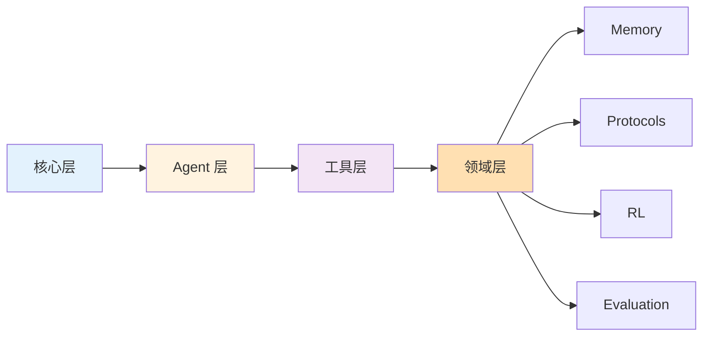

**低耦合高内聚**:

- 各模块独立可选安装
- 按需引入功能

### 5. 教学友好

**示例驱动**:

- `examples/` 目录提供完整示例
- 每个章节对应一个示例文件

**文档完善**:

- `docs/api/` 提供 API 文档
- `docs/tutorials/` 提供教程

---

## 🔄 数据流示例

### SimpleAgent 工具调用流程

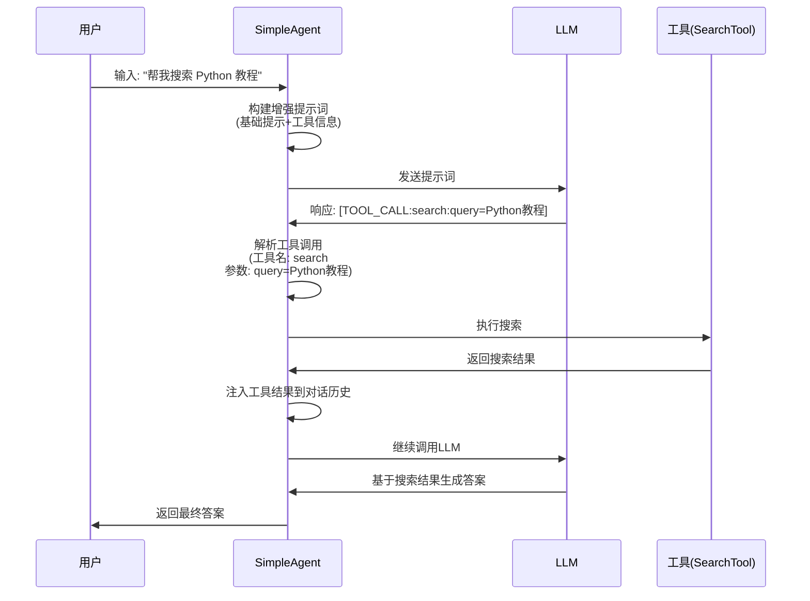

### ReActAgent 工作流程

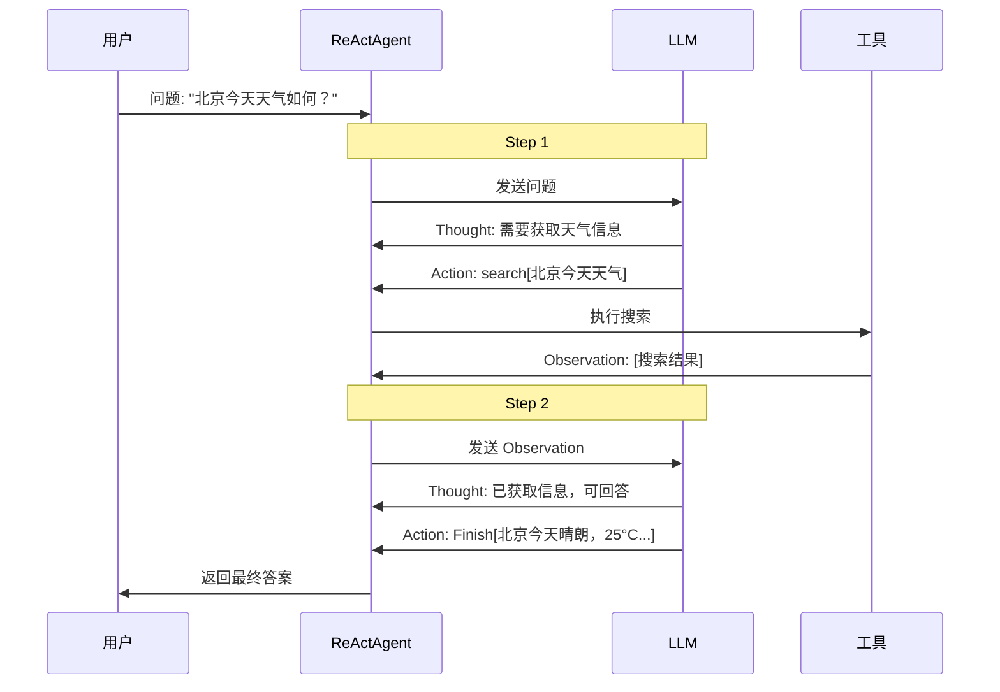

### RAG 问答流程

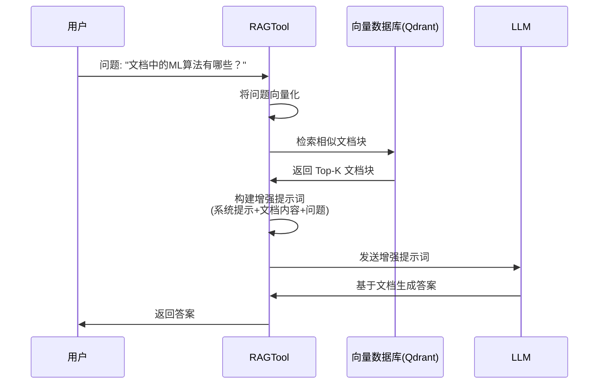

---

## 📚 典型使用场景

### 场景 1: 简单问答机器人

```python
from hello_agents import HelloAgentsLLM, SimpleAgent

llm = HelloAgentsLLM()
agent = SimpleAgent(
    name="助手",
    llm=llm,
    system_prompt="你是一个有用的AI助手"
)

response = agent.run("你好！")
```

### 场景 2: 带工具的智能助手

```python
from hello_agents import (
    HelloAgentsLLM, ReActAgent,
    ToolRegistry, search, calculate
)

llm = HelloAgentsLLM()
registry = ToolRegistry()
registry.register_function("search", "搜索引擎", search)
registry.register_function("calculate", "计算器", calculate)

agent = ReActAgent(
    name="智能助手",
    llm=llm,
    tool_registry=registry
)

response = agent.run("帮我搜索并计算 12 * 8")
```

### 场景 3: 知识库问答

```python
from hello_agents.tools.builtin import RAGTool

rag = RAGTool(knowledge_base_path="./kb")

# 添加文档
rag.run({"action": "add_document", "file_path": "document.pdf"})

# 问答
answer = rag.run({"action": "ask", "question": "文档的主要内容是什么？"})
```

### 场景 4: 带记忆的对话

```python
from hello_agents.memory import MemoryManager
from hello_agents.tools.builtin import MemoryTool

memory_manager = MemoryManager()
memory_tool = MemoryTool(memory_manager=memory_manager)

registry = ToolRegistry()
registry.register_tool(memory_tool, auto_expand=True)

agent = SimpleAgent(
    name="记忆助手",
    llm=llm,
    tool_registry=registry,
    enable_tool_calling=True
)

# Agent 可以主动调用记忆工具存储和检索信息
```

### 场景 5: MCP 协议集成

```python
from hello_agents.protocols.mcp import MCPClient
from hello_agents.tools.builtin import MCPWrapperTool

# 连接 MCP 服务器
client = MCPClient("server.py")

# 创建 MCP 工具
mcp_tool = MCPWrapperTool(
    mcp_client=client,
    auto_expand=True  # 自动展开为多个工具
)

registry = ToolRegistry()
registry.register_tool(mcp_tool)

agent = ReActAgent(name="MCP Agent", llm=llm, tool_registry=registry)
```

---

## 🛠️ 开发指南

### 添加新的 Agent 范式

1. 继承 `Agent` 基类
2. 实现 `run()` 方法
3. 定义提示词模板
4. 添加到 `__init__.py`

示例:

```python
from hello_agents.core.agent import Agent

class MyCustomAgent(Agent):
    def run(self, input_text: str, **kwargs) -> str:
        # 实现自定义逻辑
        messages = [{"role": "user", "content": input_text}]
        response = self.llm.invoke(messages)
        return response
```

### 添加新的工具

1. 继承 `Tool` 基类
2. 实现 `run()` 和 `get_parameters()` 方法
3. 可选: 使用 `@tool_action` 装饰器定义子工具
4. 注册到 `ToolRegistry`

示例:

```python
from hello_agents.tools.base import Tool, ToolParameter

class MyTool(Tool):
    def __init__(self):
        super().__init__(
            name="my_tool",
            description="我的工具"
        )

    def run(self, parameters: Dict[str, Any]) -> str:
        # 实现工具逻辑
        return "工具执行结果"

    def get_parameters(self) -> List[ToolParameter]:
        return [
            ToolParameter(
                name="input",
                type="string",
                description="输入参数",
                required=True
            )
        ]
```

### 添加新的记忆类型

1. 继承 `BaseMemory`
2. 实现抽象方法
3. 选择合适的存储后端
4. 添加到 `MemoryManager`

---

## 📈 性能优化建议

### 1. LLM 调用优化

- 使用流式响应减少等待时间
- 合理设置 `temperature` 和 `max_tokens`
- 缓存重复查询的结果

### 2. 工具执行优化

- 使用 `AsyncToolExecutor` 异步执行工具
- 工具链优化，减少不必要的调用
- 工具结果缓存

### 3. 记忆系统优化

- 定期清理低重要性记忆
- 使用工作记忆限制容量
- 向量检索优化（Qdrant 索引）

### 4. RAG 优化

- 文档分块策略优化
- 向量检索 Top-K 调优
- 重排序（Reranking）

---

## 🔐 安全性考虑

### 1. API 密钥管理

- 使用 `.env` 文件存储敏感信息
- 不要将 API 密钥硬编码
- `.env` 文件加入 `.gitignore`

### 2. 工具执行安全

- TerminalTool 谨慎使用
- 验证工具参数
- 限制工具权限

### 3. 数据隐私

- 敏感数据加密存储
- 用户数据隔离（user_id）
- 记忆数据定期清理

---

## 📖 总结

HelloAgents 是一个设计精良、模块化的多智能体框架，具有以下特点:

### 核心优势

1. **轻量级**: 核心功能依赖少，易于部署
2. **教学友好**: 清晰的架构，丰富的示例和文档
3. **高度可扩展**: 工具展开机制，模块化设计
4. **统一抽象**: 一切皆为工具，降低学习成本
5. **多范式支持**: 提供多种 Agent 范式，适应不同场景

### 技术栈

- **LLM**: OpenAI API 兼容接口
- **向量数据库**: Qdrant
- **图数据库**: Neo4j
- **文档处理**: markitdown, pypdf, sentence-transformers
- **强化学习**: TRL (Transformers Reinforcement Learning)
- **协议**: FastMCP, a2a-sdk

### 适用场景

- **教学**: 学习 Agent 开发和多智能体系统
- **研究**: Agent 范式研究，协议设计
- **应用**: 构建智能助手、知识库问答、自动化工具
- **评估**: Agent 性能测试和基准评估

---

## 🔗 参考资源

- **GitHub**: https://github.com/jjyaoao/HelloAgents
- **文档**: `docs/` 目录
- **示例**: `examples/` 目录
- **License**: CC-BY-NC-SA-4.0

---

**文档生成时间**: 2025-12-09  
**HelloAgents 版本**: v0.2.8  
**作者**: HelloAgents Team
